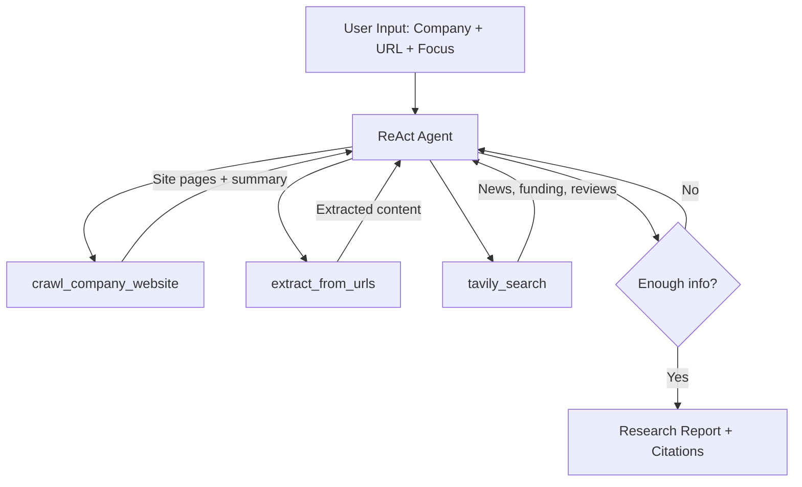

> ## Documentation Index
> Fetch the complete documentation index at: https://docs.tavily.com/llms.txt
> Use this file to discover all available pages before exploring further.

# Company Intelligence

> Build a research agent that crawls company websites, extracts content, and searches the web for comprehensive company analysis.

## What You'll Build

A ReAct agent that conducts comprehensive research on any company by combining website crawling with targeted web search. Give it a company name, website URL, and optional research focus — it autonomously crawls the site, extracts key pages, searches for external coverage, and produces a cited research report.

<Card title="View Source on GitHub" icon="github" href="https://github.com/tavily-ai/tavily-cookbook/tree/main/agent-toolkit/use-cases" horizontal />

## Architecture



The agent autonomously decides which tools to use and in what order. A typical research flow:

1. Crawl the company website to discover and summarize pages
2. Extract detailed content from specific URLs found during crawling
3. Search the web for external information (news, funding, reviews, competitors)
4. Synthesize everything into a structured report with citations

## Tools Used

| Tool                    | Purpose                                     | Tavily Toolkit Function |
| ----------------------- | ------------------------------------------- | ----------------------- |
| `crawl_company_website` | Crawl and summarize company website pages   | `crawl_and_summarize`   |
| `extract_from_urls`     | Extract detailed content from specific URLs | `extract_and_summarize` |
| `tavily_search`         | Search the web for external information     | `search_dedup`          |

## Quick Start

<Tabs>
  <Tab title="Anthropic SDK">
    <Card title="Source File" icon="github" href="https://github.com/tavily-ai/tavily-cookbook/tree/main/agent-toolkit/use-cases/claude_sdk/company_intelligence_deep_agent.py" horizontal />

    ```bash theme={null}
    pip install tavily-agent-toolkit anthropic claude-agent-sdk python-dotenv
    ```

    ```bash theme={null}
    export TAVILY_API_KEY="your-tavily-api-key"
    export ANTHROPIC_API_KEY="your-anthropic-api-key"
    ```

    ```bash theme={null}
    python company_intelligence_deep_agent.py
    ```
  </Tab>

  <Tab title="LangGraph">
    <Card title="Source File" icon="github" href="https://github.com/tavily-ai/tavily-cookbook/tree/main/agent-toolkit/use-cases/langgraph/company_intelligence_deep_agent.py" horizontal />

    ```bash theme={null}
    pip install tavily-agent-toolkit langchain langchain-openai python-dotenv
    ```

    ```bash theme={null}
    export TAVILY_API_KEY="your-tavily-api-key"
    export OPENAI_API_KEY="your-openai-api-key"
    ```

    ```bash theme={null}
    python company_intelligence_deep_agent.py
    ```
  </Tab>
</Tabs>

## How It Works

<AccordionGroup>
  <Accordion title="Tool Wiring">
    Each tool wraps a Tavily Agent Toolkit function with agent-friendly parameters:

    * **`crawl_company_website`** calls `crawl_and_summarize` with the company URL, optional extraction instructions, and depth/breadth controls. Returns a summarized overview of the crawled pages.
    * **`extract_from_urls`** calls `extract_and_summarize` with specific URLs and an optional query focus. Uses `extract_depth="advanced"` for full content extraction.
    * **`tavily_search`** calls `search_dedup` with multiple queries in parallel, returning deduplicated and formatted results with `search_depth="advanced"`.
  </Accordion>

  <Accordion title="System Prompt">
    The agent is prompted as a business intelligence analyst:

    ```text theme={null}
    You are a business intelligence analyst researching companies.

    You have three tools available:
    - crawl_company_website - Crawl a company's website
    - extract_from_urls - Extract content from specific URLs
    - tavily_search - Search the web for news, funding, reviews

    Combine website insights with external sources for a
    complete picture. Include citations [1], [2], etc.
    ```
  </Accordion>

  <Accordion title="Streaming Progress">
    Both implementations stream tool calls as they happen, so you can see the agent's progress in real time:

    ```text theme={null}
    [1] Crawling website -> https://anthropic.com
    [2] Searching the web -> 3 query/queries
    [3] Extracting URLs -> 2 URL(s)
    ```
  </Accordion>

  <Accordion title="Summarizer Model">
    The `crawl_and_summarize` and `extract_and_summarize` tools use a dedicated summarizer model (configured via `ModelConfig`). In the examples, a smaller model is used for summarization to keep costs low while the main agent model handles reasoning.
  </Accordion>
</AccordionGroup>

## Example Interaction

```text theme={null}
============================================================
Company Intelligence Research Agent
============================================================

Company name: Anthropic
Website URL:  https://anthropic.com
Research focus: leadership team and recent funding

------------------------------------------------------------
Researching Anthropic (https://anthropic.com)
Focus: leadership team and recent funding
------------------------------------------------------------

[1] Crawling website -> https://anthropic.com
[2] Searching the web -> 3 query/queries
[3] Extracting URLs -> 2 URL(s)

Completed in 23.4s | 4 turns

============================================================
RESEARCH REPORT
============================================================

Anthropic is an AI safety company founded in 2021...
[Comprehensive report with citations]
```

## Example Research Topics

* Company overview and products
* Leadership team and organizational structure
* Recent funding rounds and investors
* Competitive landscape
* Customer reviews and reputation
* Technology stack and engineering culture

## Key Parameters to Tune

| Parameter       | Where                   | Effect                                           |
| --------------- | ----------------------- | ------------------------------------------------ |
| `max_depth`     | `crawl_company_website` | How deep to crawl from the homepage (default: 2) |
| `max_breadth`   | `crawl_company_website` | Pages per crawl level (default: 10)              |
| `limit`         | `crawl_company_website` | Total page cap (default: 20)                     |
| `extract_depth` | `extract_from_urls`     | `"basic"` or `"advanced"` for full content       |
| `max_results`   | `tavily_search`         | Results per search query (default: 5)            |
| `topic`         | `tavily_search`         | `"general"`, `"news"`, or `"finance"`            |

## Next Steps

<CardGroup cols={2}>
  <Card title="Social Media Research" icon="hashtag" href="/examples/agent-toolkit/social-media-research">
    Add social media intelligence to your agent with platform-specific search.
  </Card>

  <Card title="Hybrid Research" icon="flask" href="/examples/agent-toolkit/hybrid-research">
    Combine internal company data with web research for deeper analysis.
  </Card>
</CardGroup>
