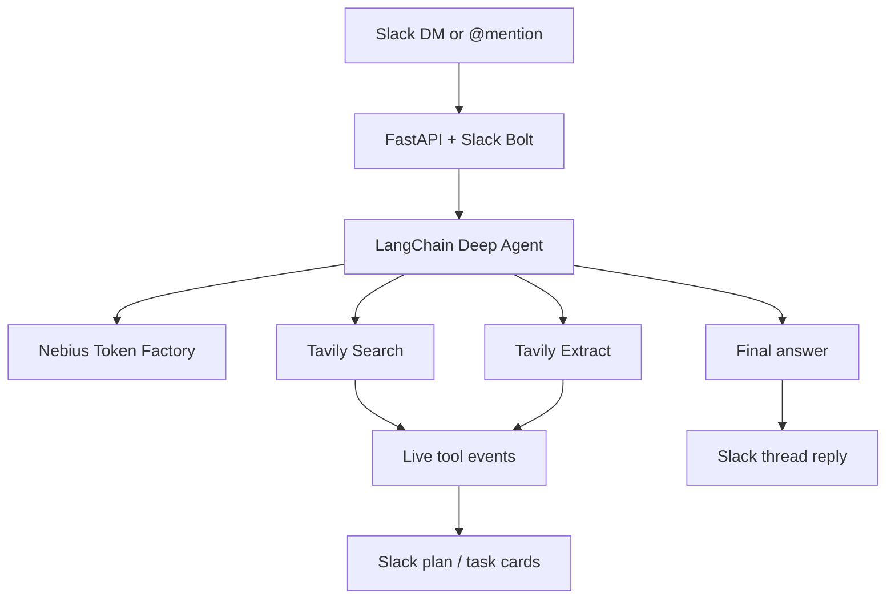

> ## Documentation Index
> Fetch the complete documentation index at: https://docs.tavily.com/llms.txt
> Use this file to discover all available pages before exploring further.

# Slack Research Agent

> A research Slack agent backed by a LangChain Deep Agent, with Tavily search and extract as tools.

## Introduction

Tavily Scout is an open-source Slack research agent. DM it or @mention it in a channel and it answers with live web research — streaming search and extract activity into Slack as it works, then posting a cited reply in the same thread.

<Card title="View Github Repository" icon="github" href="https://github.com/lakshyaag-tavily/tavily-fde-roundtable-webinar-slackagent" horizontal />

## Try It

This app runs in your own Slack workspace. Clone the repo, add API keys, and install the Slack app from the included manifest.

### Step 1: Get Your API Keys

<Card title="Get your Tavily API key" icon="key" href="https://app.tavily.com" horizontal />

<Card title="Get your Nebius API key" icon="key" href="https://tokenfactory.nebius.com" horizontal />

### Step 2: Clone the App

<Card title="View Github Repository" icon="github" href="https://github.com/lakshyaag-tavily/tavily-fde-roundtable-webinar-slackagent" horizontal />

## Architecture



The agent exposes only two tools: **Tavily Search** (advanced web search) and **Tavily Extract** (full-page content). Deep Agent filesystem and subagent extras are disabled so every tool call is Tavily.

## Features

1. **Live tool streaming**: Search and extract calls show up in Slack as plan and task cards, including source links, while the agent is still running.
2. **Cited thread replies**: The final answer lands in the same Slack thread, formatted for Slack mrkdwn with source links.
3. **Model switching**: Switch models per user with `/agent-model`. New threads use the selected model; existing threads stay on the model they started with.
4. **Thread-aware**: The agent uses preceding thread messages as context so follow-ups stay grounded in the conversation.
5. **In-process runtime**: FastAPI, Slack Bolt, and the Deep Agent run in one Python process. Model preferences and thread history live in memory and reset on restart.

## How It Works

<AccordionGroup>
  <Accordion title="1. Slack events">
    Slack DMs and @mentions arrive over the Events API at `/events/slack`. FastAPI + Slack Bolt verify the request, deduplicate events, and start an in-process agent turn.
  </Accordion>

  <Accordion title="2. Tavily tools">
    The Deep Agent can call Tavily Search when it needs current or external information, then Tavily Extract to read specific result pages in detail. For stable facts or conversation that does not need the web, it answers directly.

    ```python theme={null}
    TavilySearch(max_results=10, search_depth="advanced")
    TavilyExtract(extract_depth="advanced")
    ```
  </Accordion>

  <Accordion title="3. Live Slack updates">
    While Tavily runs, tool events stream into a Slack plan message. Users see search queries, extract URLs, and source links before the final reply is posted.
  </Accordion>

  <Accordion title="4. Model selection">
    `/agent-model` lists aliases and sets a user default:

    ```text theme={null}
    /agent-model list
    /agent-model gpt
    /agent-model kimi
    /agent-model nemotron
    /agent-model status
    ```

    * `gpt` → `openai/gpt-5.6-sol` (default)
    * `kimi` → `nebius:moonshoot/Kimi-K3`
    * `nemotron` → `nebius:nvidia/Nemotron-3_5-Lightning`
  </Accordion>
</AccordionGroup>

## Setup

<Steps>
  <Step title="Configure">
    ```bash theme={null}
    cd backend
    cp .env.example .env
    ```

    Fill in `OPENAI_API_KEY`, `NEBIUS_API_KEY`, and `TAVILY_API_KEY`. Slack bot token and signing secret are added after you create the Slack app.
  </Step>

  <Step title="Run the server">
    From the repository root:

    ```bash theme={null}
    docker compose up
    ```

    Check [http://127.0.0.1:8000/health](http://127.0.0.1:8000/health).
  </Step>

  <Step title="Start a tunnel">
    With the agent listening on port 8000:

    ```bash theme={null}
    ./scripts/setup_cloudflare.sh
    ```

    Copy the generated HTTPS URL into both `url` fields in `slack-app-manifest.json`:

    ```text theme={null}
    https://YOUR-TUNNEL.trycloudflare.com/events/slack
    ```
  </Step>

  <Step title="Create the Slack app">
    1. Go to [api.slack.com/apps](https://api.slack.com/apps) → **Create New App** → **From a manifest**.
    2. Paste `slack-app-manifest.json` and replace the tunnel placeholder.
    3. Install the app to the workspace.
    4. Copy the **Bot User OAuth Token** and **Signing Secret** into `backend/.env`.
    5. Restart the agent.
    6. DM the bot or mention it in a channel.
  </Step>
</Steps>
