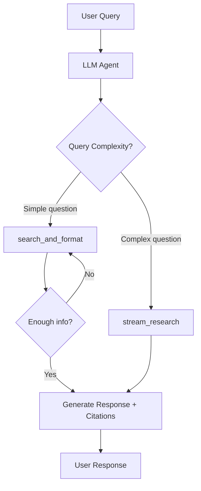

> 원본: https://docs.tavily.com/examples/agent-toolkit/chatbot.md

> ## Documentation Index
> Fetch the complete documentation index at: https://docs.tavily.com/llms.txt
> Use this file to discover all available pages before exploring further.

# Chatbot

> Build a conversational chatbot that routes between quick web search and deep research based on query complexity.

## What You'll Build

An interactive chatbot that uses Tavily tools to answer questions with real-time web data. It dynamically chooses between lightweight search (for simple factual questions) and deep research (for complex, multi-source analysis) — then synthesizes answers with numbered citations.

<Card title="View Source on GitHub" icon="github" href="https://github.com/tavily-ai/tavily-cookbook/tree/main/agent-toolkit/use-cases" horizontal />

## Architecture



**Key behavior:**

* The agent can call `search_and_format` **multiple times** until it has enough information
* The agent can only call `stream_research` **once** per query (comprehensive but expensive)
* All responses include numbered citations linking to sources

## Tools Used

| Tool                | When Used                                                    | Description                                                     |
| ------------------- | ------------------------------------------------------------ | --------------------------------------------------------------- |
| `search_and_format` | Simple, factual questions ("What is the capital of France?") | Runs parallel web searches and returns formatted results        |
| `stream_research`   | Complex queries requiring analysis, comparisons, or trends   | Uses Tavily's deep research endpoint for multi-source synthesis |

## Quick Start

<Tabs>
  <Tab title="Anthropic SDK">
    <Card title="Source File" icon="github" href="https://github.com/tavily-ai/tavily-cookbook/tree/main/agent-toolkit/use-cases/claude_sdk/chatbot.py" horizontal />

    ```bash theme={null}
    pip install tavily-agent-toolkit anthropic tavily-python python-dotenv
    ```

    ```bash theme={null}
    export TAVILY_API_KEY="your-tavily-api-key"
    export ANTHROPIC_API_KEY="your-anthropic-api-key"
    ```

    ```bash theme={null}
    python chatbot.py
    ```
  </Tab>

  <Tab title="LangGraph">
    <Card title="Source File" icon="github" href="https://github.com/tavily-ai/tavily-cookbook/tree/main/agent-toolkit/use-cases/langgraph/chatbot.py" horizontal />

    ```bash theme={null}
    pip install tavily-agent-toolkit langchain langchain-openai tavily-python python-dotenv
    ```

    ```bash theme={null}
    export TAVILY_API_KEY="your-tavily-api-key"
    export OPENAI_API_KEY="your-openai-api-key"
    ```

    ```bash theme={null}
    python chatbot.py
    ```
  </Tab>
</Tabs>

## How It Works

<AccordionGroup>
  <Accordion title="Tool Definitions">
    The chatbot exposes two tools to the LLM. The agent decides which to call based on the query:

    * **`search_and_format`** — wraps `tavily_agent_toolkit.search_and_format` to run parallel web searches across one or more queries. Accepts an optional `time_range` filter.
    * **`stream_research`** — calls Tavily's research API in streaming mode via `tavily_agent_toolkit.handle_research_stream`, returning a comprehensive report.
  </Accordion>

  <Accordion title="Routing Logic">
    The system prompt instructs the agent to pick the right tool:

    ```
    For simple questions, use search_and_format.
    For complex questions, use stream_research.

    You can call search_and_format multiple times.
    You can only use stream_research ONCE.
    ```

    This keeps costs low for quick lookups while enabling deep research when needed.
  </Accordion>

  <Accordion title="Agent Loop">
    The chatbot runs a standard agent loop:

    1. Send the user message + tool definitions to the LLM
    2. If the LLM returns a tool call, execute it and feed the result back
    3. Repeat until the LLM returns a final text response
    4. Print the response with citations and continue the conversation
  </Accordion>

  <Accordion title="Citation Handling">
    The system prompt enforces citation discipline:

    ```
    Use numbered in-text citations [1], [2], etc.
    At the end, include a "Sources:" section with only
    the sources you actually cited.
    Format: [number] Title - URL
    ```
  </Accordion>
</AccordionGroup>

## Example Interaction

```text theme={null}
Chatbot ready! Type 'quit' to exit.

You: What are the latest developments in quantum computing?
[Using stream_research...]
Assistant: Recent developments in quantum computing include several
breakthroughs. Google's Willow chip demonstrated error correction
below the threshold needed for practical quantum computing [1].
Microsoft announced its Majorana 1 chip using topological qubits [2].
IBM continues to expand its quantum roadmap with plans for 100,000+
qubit systems by 2033 [3].

Sources:
[1] Google Quantum AI Blog - https://blog.google/technology/research/...
[2] Microsoft Research - https://www.microsoft.com/en-us/research/...
[3] IBM Research - https://research.ibm.com/blog/...

You: Who is the CEO of Apple?
[Using search_and_format...]
Assistant: Tim Cook is the CEO of Apple [1]. He has held the position
since August 2011, succeeding Steve Jobs.

Sources:
[1] Apple Leadership - https://www.apple.com/leadership/tim-cook/
```

## Key Parameters to Tune

| Parameter     | Where               | Effect                                                             |
| ------------- | ------------------- | ------------------------------------------------------------------ |
| `model`       | Agent creation      | Controls reasoning quality and cost                                |
| `max_results` | `search_and_format` | Number of search results per query (default: 5)                    |
| `model`       | `research` call     | `"mini"` for faster, `"default"` for more thorough                 |
| `time_range`  | `search_and_format` | Filter results by recency (`"day"`, `"week"`, `"month"`, `"year"`) |

## Next Steps

<CardGroup cols={2}>
  <Card title="Tools Reference" icon="wrench" href="/examples/agent-toolkit/tools">
    Full parameter docs for search\_and\_format and all other tools.
  </Card>

  <Card title="Company Intelligence" icon="building" href="/examples/agent-toolkit/company-intelligence">
    Add website crawling and extraction to your agent's capabilities.
  </Card>
</CardGroup>
