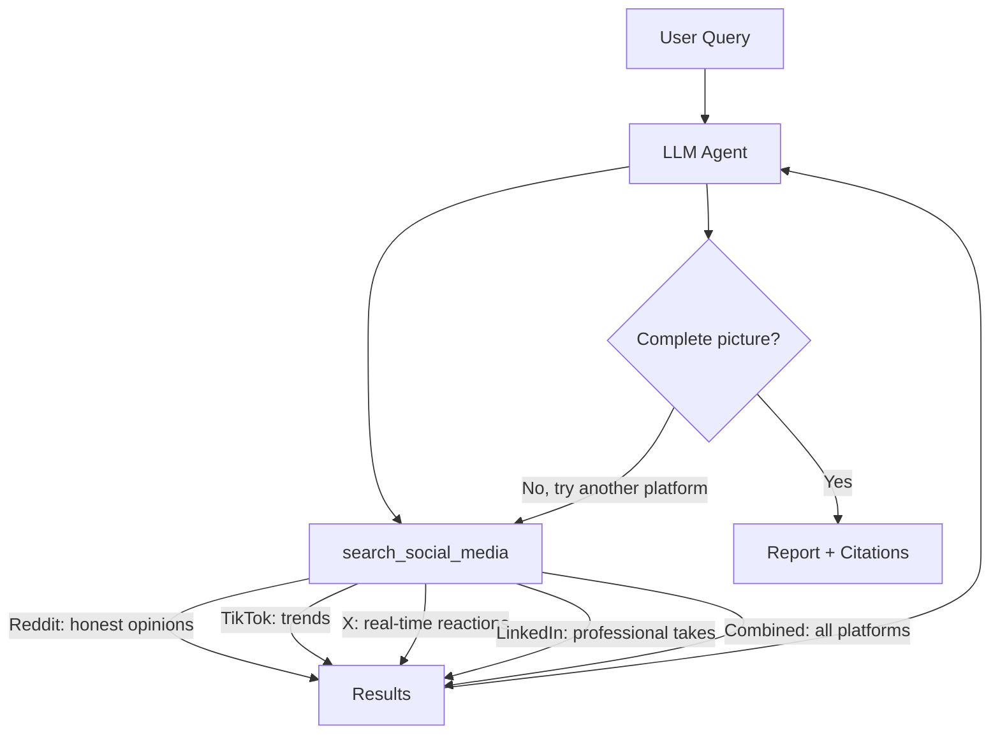

> 원본: https://docs.tavily.com/examples/agent-toolkit/social-media-research.md

> ## Documentation Index
> Fetch the complete documentation index at: https://docs.tavily.com/llms.txt
> Use this file to discover all available pages before exploring further.

# Social Media Research

> Build an agent that searches across TikTok, Reddit, X, LinkedIn, and more to research any topic from social media.

## What You'll Build

A general-purpose research agent that searches across social media platforms — TikTok, Reddit, Instagram, X, Facebook, and LinkedIn — to gather real-world opinions, discussions, and insights on any topic. The agent strategically targets different platforms based on the kind of information it needs and synthesizes findings into a cited report.

<Card title="View Source on GitHub" icon="github" href="https://github.com/tavily-ai/tavily-cookbook/tree/main/agent-toolkit/use-cases" horizontal />

## Architecture



The agent calls `search_social_media` multiple times with different queries and platform targets to build a complete picture before synthesizing.

## Tools Used

| Tool                  | Platforms                                                     | Description                                                                                                     |
| --------------------- | ------------------------------------------------------------- | --------------------------------------------------------------------------------------------------------------- |
| `search_social_media` | TikTok, Instagram, Reddit, X, Facebook, LinkedIn, or combined | Searches social platforms with platform-specific targeting, time filtering, and optional raw content extraction |

The agent can customize each search call with:

* **`platform`** — target a specific platform or search all with `"combined"`
* **`max_results`** — control how many results to fetch
* **`time_range`** — filter by `"day"`, `"week"`, `"month"`, or `"year"`
* **`include_raw_content`** — extract full post content for deeper analysis

## Quick Start

<Tabs>
  <Tab title="Anthropic SDK">
    <Card title="Source File" icon="github" href="https://github.com/tavily-ai/tavily-cookbook/tree/main/agent-toolkit/use-cases/claude_sdk/social_media_research.py" horizontal />

    ```bash theme={null}
    pip install tavily-agent-toolkit anthropic tavily-python python-dotenv
    ```

    ```bash theme={null}
    export TAVILY_API_KEY="your-tavily-api-key"
    export ANTHROPIC_API_KEY="your-anthropic-api-key"
    ```

    ```bash theme={null}
    python social_media_research.py
    ```
  </Tab>

  <Tab title="LangGraph">
    <Card title="Source File" icon="github" href="https://github.com/tavily-ai/tavily-cookbook/tree/main/agent-toolkit/use-cases/langgraph/social_media_research.py" horizontal />

    ```bash theme={null}
    pip install tavily-agent-toolkit langchain langchain-openai tavily-python python-dotenv
    ```

    ```bash theme={null}
    export TAVILY_API_KEY="your-tavily-api-key"
    export OPENAI_API_KEY="your-openai-api-key"
    ```

    ```bash theme={null}
    python social_media_research.py
    ```
  </Tab>
</Tabs>

## How It Works

<AccordionGroup>
  <Accordion title="Platform Strategy">
    The system prompt guides the agent to use platforms strategically:

    ```text theme={null}
    Reddit is great for honest opinions
    TikTok for trends
    X for real-time reactions
    LinkedIn for professional takes
    ```

    The agent typically makes 2-4 search calls, targeting different platforms or using different query angles to build comprehensive coverage.
  </Accordion>

  <Accordion title="Tool Configuration">
    The `search_social_media` tool wraps `tavily_agent_toolkit.social_media_search` with these defaults:

    * `search_depth="advanced"` for thorough content extraction
    * `include_answer=True` to get an AI-synthesized summary alongside raw results
    * `time_range="month"` as a sensible default for recency

    The agent can override these per-call based on what it needs.
  </Accordion>

  <Accordion title="Synthesis and Citations">
    After gathering results from multiple platforms, the agent synthesizes findings into a clear report with inline citations `[1]`, `[2]` and a sources list with URLs at the end.
  </Accordion>
</AccordionGroup>

## Example Interaction

```text theme={null}
============================================================
Social Media Research Agent
============================================================

This agent searches across TikTok, Reddit, Instagram, X,
Facebook, and LinkedIn to research any topic.

What would you like to research?
> What are people saying about the new iPhone?
------------------------------------------------------------
Researching...

[Searching social media on reddit...]
[Searching social media on x...]
[Searching social media on tiktok...]

============================================================
REPORT
============================================================

The new iPhone has generated significant discussion across
social media platforms. On Reddit, users are largely positive
about the camera improvements [1] but divided on the pricing [2].
TikTok creators have been showcasing the new camera features
with comparisons to previous models [3]. On X, the real-time
reaction has been mixed, with praise for performance but
criticism of incremental updates [4]...

Sources:
[1] r/apple - "iPhone 16 Pro Max camera review" - https://...
[2] r/iphone - "Is the upgrade worth it?" - https://...
[3] TikTok - @techreviewer - https://...
[4] X - @mkbhd - https://...
```

## Example Research Topics

* Product reviews and sentiment ("What do people think of the Dyson Airwrap?")
* Trending discussions ("What's viral on TikTok this week?")
* Public opinion ("How do people feel about remote work?")
* Event reactions ("What are people saying about the Super Bowl?")
* Travel recommendations ("Best hiking spots according to Reddit?")
* Brand perception ("How is Company X perceived on LinkedIn vs Reddit?")

## Key Parameters to Tune

| Parameter             | Effect                                                                                                         |
| --------------------- | -------------------------------------------------------------------------------------------------------------- |
| `platform`            | Target a specific platform or `"combined"` for all. Use `"reddit"` for honest opinions, `"tiktok"` for trends. |
| `max_results`         | Number of results per search call (default: 10)                                                                |
| `time_range`          | `"day"` for breaking news, `"month"` for broader trends                                                        |
| `include_raw_content` | `true` for full post text, `false` for snippets only                                                           |

## Next Steps

<CardGroup cols={2}>
  <Card title="Company Intelligence" icon="building" href="/examples/agent-toolkit/company-intelligence">
    Combine social media research with website crawling for full company analysis.
  </Card>

  <Card title="Tools Reference" icon="wrench" href="/examples/agent-toolkit/tools">
    Full documentation for social\_media\_search and all other tools.
  </Card>
</CardGroup>
